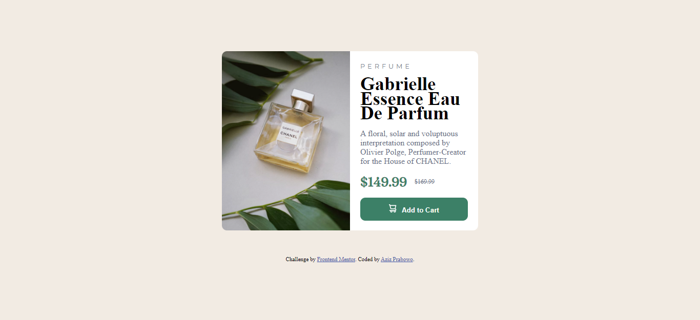

# Frontend Mentor - Product preview card component solution

This is a solution to the [Product preview card component challenge on Frontend Mentor](https://www.frontendmentor.io/challenges/product-preview-card-component-GO7UmttRfa). Frontend Mentor challenges help you improve your coding skills by building realistic projects.


## Table of contents

- [Overview](#overview)
  - [The challenge](#the-challenge)
  - [Screenshot](#screenshot)
  - [Links](#links)
- [My process](#my-process)
  - [Built with](#built-with)
  - [What I learned](#what-i-learned)
- [Author](#author)

## Overview

### The challenge

Users should be able to:

- View the optimal layout depending on their device's screen size
- See hover and focus states for interactive elements

### Screenshot



### Links

- Solution URL: [SOLUTION](https://your-solution-url.com)
- Live Site URL: [LIVE SITE](https://azizp128.github.io/product-preview-card/)

## My process

### Built with

- Semantic HTML5 markup
- Flexbox
- Mobile-first workflow

### What I learned

I learned many things about web responsive in this challenge.

To see how you can add code snippets, see below:

```css
@media (max-width: 500px) {
  .card {
    padding: 15px;
    flex-direction: column;
  }

  .card-img .image {
    width: 100%;
    height: 250px;
    background-image: url(images/image-product-mobile.jpg);
    background-size: cover;
    border-top-right-radius: 10px;
    border-bottom-left-radius: 0;
  }

  .card-details {
    border-bottom-left-radius: 10px;
    border-top-right-radius: 0;
  }

  .container {
    margin-top: 0;
  }

  .attribution {
    margin-top: 220px;
  }
}
```

## Author

- Website - [Aziz Prabowo](https://azizp128.github.io/)
- Frontend Mentor - [@azizp128](https://www.frontendmentor.io/profile/yourusername)
- Twitter - [@azizprbw](https://www.twitter.com/azizprbw)
